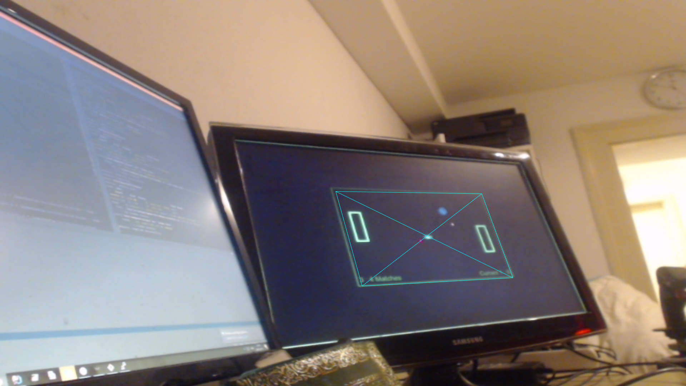

# Laser Api

[Developer Documentation](LASER_API.md)

[Actual frontend usage](FRONTEND.md)

## summary

Idea is to use laser pointers as input, for that this api provides an output raster that is configured with a laser color and provides information if laser is pointing to that direction.

for that simple recording of output using a video stream and a easy texture transform to map the area of interest.

## Demo

master deoployment
https://laser.froso.de/

development deployment
https://laser-dev.froso.de/

## License

Licensed under MIT

### Snapshot of Setup

This playfield is controlled via the red laser dot you see in the next image, the turkis area is what the api provides to the LaserApi application interface, as often as possible :)

here you see the raw video/webcam input the marked ared with the "X" is what is scanned for desired color and then filtered out and normalized to above grid playfield input

Copyright (c) 2017 [Christian Kleinhuis](https://github.com/alexanderthurn) [Alexander Thurn](https://github.com/alexanderthurn)
